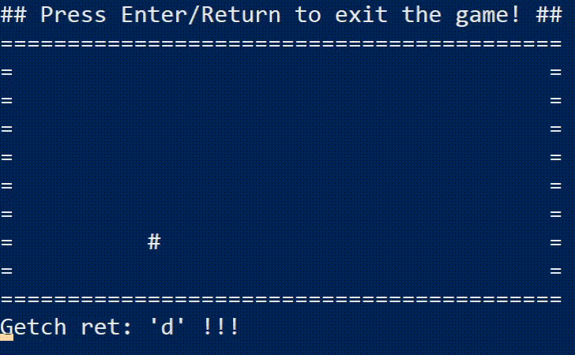

# A simple game in the console made for the purpose of learning rust!

This branch contains a version that uses a transmitter and a reciever instead of arcs and mutexes. :D

To run it just `cargo run`. :D

Here's how it looks like:

